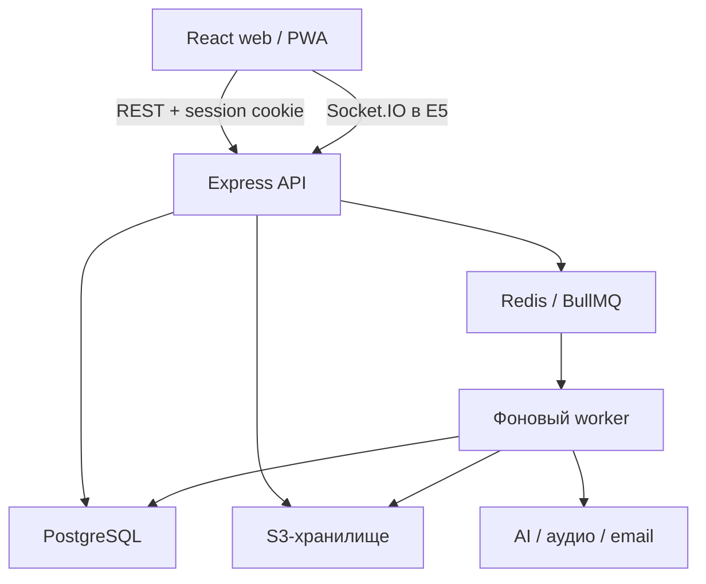

# Стек и архитектура Memly

Дата: 6 октября 2026 года. Решение: TypeScript-монорепозиторий, React-клиент и модульный монолит на Express с PostgreSQL. Код приложений ещё не реализован.

## Технологический стек

| Область | Выбранная технология | Назначение / момент подключения |
| --- | --- | --- |
| Язык | TypeScript, `strict` | Клиент, сервер, контракты и учебный движок |
| Runtime | Node.js 24 LTS | API, worker и инструменты разработки |
| Клиент | React 19 + Vite | SPA, сборка и разработка |
| Маршруты | React Router | Страницы, параметры, разделы приложения |
| Серверные данные в UI | TanStack Query | Загрузка, кэширование, мутации и инвалидация |
| Локальное состояние | React state/reducer/context | Сессия интерфейса и настройки; отдельный store пока не нужен |
| Формы | React Hook Form + Zod | Редактор и формы с согласованной валидацией |
| UI | Tailwind CSS + Radix UI | Стили, токены и доступные интерактивные компоненты |
| Локализация | i18next + react-i18next | Подготовка интерфейса к языкам; сначала русский |
| API | Express 5, REST/JSON | Версионированный HTTP-интерфейс |
| Авторизация | Better Auth, адаптер Drizzle | Серверные сессии, email/password; OAuth по необходимости |
| База данных | PostgreSQL 18 | Долговременные данные и транзакции |
| Доступ к БД | Drizzle ORM + `pg` | Типизированные запросы; SQL остаётся доступным |
| Миграции | Drizzle Kit + проверяемые SQL-файлы | Контролируемое изменение схемы |
| Поиск | PostgreSQL FTS + `pg_trgm` | Поиск по доступным наборам без отдельного поискового сервиса |
| Интервальные повторения | FSRS через `ts-fsrs` | Планирование повторов в серверном учебном движке |
| Документация API | OpenAPI 3.1, схемы Zod | Документация и проверка публичных контрактов |
| Фоновые задачи | Redis + BullMQ | Добавляются для тяжёлых загрузок, AI и уведомлений |
| Мультиплеер | Socket.IO | Добавляется в E5; адаптер Redis при нескольких API-процессах |
| Файлы | S3-совместимое объектное хранилище | Добавляется вместе с медиа; конкретный хостинг выбирается позднее |
| Rich text / формулы | Tiptap + KaTeX | Расширенный редактор в E3 |
| PWA / offline | Service worker, Workbox, IndexedDB через Dexie | Выбранные наборы и очередь событий в E7 |
| AI | Серверные адаптеры генерации, STT и TTS | Провайдер и модели выбираются до E6 по региону, бюджету и тестам качества |
| Email | Nodemailer через SMTP | Подтверждение, восстановление, уведомления; провайдер выбирается до E1 |
| Логи | Pino, request ID | Структурированные журналы без паролей и учебного содержимого |
| Тесты | Vitest, RTL, MSW, Supertest, Testcontainers, Playwright | Правила, UI, API с настоящим PostgreSQL и сквозные сценарии |
| Репозиторий | pnpm workspaces | Один репозиторий и общие пакеты |
| Качество | ESLint, Prettier, EditorConfig | Типы, границы импортов и единое форматирование |
| CI | GitHub Actions | Сборка, типы, стиль и необходимые тесты |
| Развёртывание | Docker, Docker Compose, Caddy | Обычный контейнерный хостинг; HTTPS и единый origin |

Node.js 24 отмечен официально как LTS; PostgreSQL 18 — поддерживаемая ветка; React 19 — стабильная основная ветка. Drizzle поддерживает PostgreSQL, Better Auth имеет официальный Drizzle-адаптер, а `ts-fsrs` — поддерживаемая TypeScript-реализация FSRS. Ссылки на первичные источники приведены ниже.

Это выбор технологий, а не утверждение, что все зависимости уже установлены. Patch-версии, версия pnpm и lockfile фиксируются в E1 после проверки совместимости. Preview/beta-версии в базовый стек не включаются. Версии адаптеров Better Auth и API отношений Drizzle выбираются как совместимая пара.

## Границы системы

Web, API и worker — единицы запуска одного проекта. Worker появляется вместе с фоновыми сценариями, использует те же серверные правила и не является отдельным продуктовым микросервисом. Redis хранит временную координацию и очереди; PostgreSQL остаётся источником долговременного прогресса и результатов.

При первой реализации web и `/api` доступны через один origin. Это упрощает конфигурацию cookie и CORS. API закрывает доступ к PostgreSQL: браузер не получает учётные данные БД.

## Модули API

| Модуль | Ответственность |
| --- | --- |
| `auth` | Интеграция Better Auth, сессии и идентичность |
| `users` | Профиль, часовой пояс и настройки |
| `decks` | Наборы, карточки, версии, черновики и публикация |
| `library` | Папки, теги, избранное и недавние материалы |
| `search` | Индексация и поиск с фильтрацией доступа |
| `study` | Сессии, вопросы, ответы, проверка, прогресс и FSRS |
| `games` | Правила игр, рекорды, комнаты и события Live |
| `groups` | Учебные группы, классы, участники и приглашения |
| `assignments` | Назначения, сроки и отчёты преподавателя |
| `media` | Проверка, метаданные и разрешения на файлы |
| `ai` | Задания генерации, источники, квоты и черновики |
| `notifications` | Предпочтения, напоминания и доставка |
| `moderation` | Жалобы, действия администратора и аудит |
| `billing` | Тарифы и права доступа; подключается при монетизации |

Модули появляются по этапам. Для бизнес-модуля используется последовательность «маршрут/контроллер → сценарий/сервис → запросы к данным». Сложные политики можно выделять отдельно; не создаём пустые классы и интерфейсы для каждого вызова ради структуры.

Модуль обращается к другому через явную публичную функцию/контракт. Общий каталог `utils` не становится местом для несвязанных бизнес-правил. Авторизация ресурса выполняется в сценарии, чтобы те же правила действовали для HTTP, Socket.IO и worker.

## Клиент

| Слой | Содержимое | Допустимые зависимости |
| --- | --- | --- |
| `app` | Маршруты, провайдеры, глобальные стили | Нижележащие слои |
| `pages` | Сборка экранов | features, entities, shared |
| `features` | Создание набора, импорт, отправка ответа и другие действия | entities, shared, публичные контракты |
| `entities` | Представление набора, карточки и профиля | shared, публичные контракты |
| `shared` | UI-инфраструктура, HTTP-клиент и нейтральные функции | Общие безопасные пакеты |

Данные API хранятся через TanStack Query. Набор не дублируется во втором глобальном store. Форма редактора управляется React Hook Form, а динамика текущего игрового экрана — reducer/state. На уровне пакетов запрещены циклические импорты и импорт `database` в web.

## Публичные контракты

`packages/contracts` содержит Zod-схемы и выводимые типы DTO. Схема БД не является публичным API. Из ответов исключаются хэши, session-токены, ключи файлов, скрытые эталоны теста и внутренние административные поля.

Auth использует контракт Better Auth под `/api/auth`. Прикладной REST начинается с `/api/v1`. Пример ожидаемых групп ресурсов:

| Ресурс | Примеры будущих действий |
| --- | --- |
| `/api/v1/decks` | Создать, получить, изменить, опубликовать набор |
| `/api/v1/decks/:id/cards` | Добавить и упорядочить карточки |
| `/api/v1/library` | Папки и личная библиотека |
| `/api/v1/study/sessions` | Начать, продолжить, завершить сессию |
| `/api/v1/study/sessions/:id/answers` | Принять учебное действие идемпотентно |
| `/api/v1/reviews` | Очередь повторений и запись оценки памяти |
| `/api/v1/groups` | Участники и материалы групп |
| `/api/v1/assignments` | Назначения и результаты |
| `/api/v1/ai/jobs` | Запуск, статус и отмена генерации |

Ошибки имеют стабильный код, безопасное сообщение, детали валидации и request ID. Коллекции используют пагинацию; изменения учитывают ревизию/версию ресурса. Ошибка устаревшей версии не должна молча перезаписывать более новые изменения.

## Логическая модель данных

Это проект модели, а не готовая SQL-схема. Обязательные ограничения уточняются при миграциях.

| Сущность | Основные данные / связь |
| --- | --- |
| `users`, auth accounts/sessions/verifications | Идентичность по схеме Better Auth; профиль и настройки отдельно |
| `decks` | Владелец, название, описание, языки, видимость, ревизия, статус черновика |
| `cards`, `card_versions` | Стабильный ID, порядок, версии сторон и допустимые альтернативные ответы |
| `deck_versions` | Ревизия опубликованного/изучаемого набора |
| `folders`, `folder_decks`, `tags` | Организация библиотеки; связи многие-ко-многим |
| `deck_saves`, `card_favorites` | Личные сохранения и отмеченные карточки |
| `deck_access`, `share_links` | ACL, отзываемые ссылки и ограниченный доступ |
| `study_sessions`, `session_questions` | Режим, настройки, состояние, снимок конкретного вопроса |
| `study_answers` | Ответ, результат, время, версия правила; уникальный ID события |
| `card_progress` | Состояние пользователя для карточки и направления |
| `review_states`, `review_logs` | FSRS-состояние, due date, версия алгоритма и журнал оценок |
| `game_runs`, `game_events` | Режим, действия, проверенный результат и рекорд |
| `groups`, `group_members`, `group_decks`, `invitations` | Класс/группа, роли в группе, разрешённые материалы |
| `assignments`, `assignment_attempts` | Режим, материал, сроки и участники |
| `live_sessions`, `live_participants` | Лобби, ведущий, команды и итоговая запись; активное состояние также в Redis |
| `media_assets` | Владелец, MIME, размер, статус и внутренний ключ хранилища |
| `source_documents`, `ai_jobs`, `generated_materials` | Источник, статус задания, расход и проверяемый черновик |
| `notifications`, `reports`, `audit_events` | Доставка, модерация и журнал действий |
| `plans`, `subscriptions`, `payment_events` | Только при коммерческом релизе |

Прогресс имеет уникальность `(user_id, card_id, direction)`: разные пользователи и разные направления обучения не делят состояние. События ответов имеют уникальный `(user_id, client_event_id)` для безопасного повтора запроса. Все внешние ключи и правила удаления определяются явно; поля времени используют `timestamptz` и UTC.

Редактирование карточки создаёт новую версию. Уже начавшаяся попытка работает со своим снимком. Существенное изменение содержимого помечает прежний прогресс как требующий пересмотра; сброс или перенос делается по понятной пользователю политике. Копия набора получает новые ID и собственный прогресс.

Нужны индексы на владельца и видимость набора, карточки набора, очередь `(user_id, due_at)`, членство в группах и уникальные идентификаторы событий. PostgreSQL FTS/триграммы используются с проверкой языка и плана запроса. Private/unlisted-материалы не попадают в публичный поисковый индекс.

## Учебный движок

Движок — набор чистых функций и стратегий, а не компонент React. Он принимает материал, состояние, настройки, время и источник случайности, затем выдаёт вопрос, результат проверки или изменение расписания. Это позволяет воспроизводить попытки и проверять логику без браузера и БД.

Направление карточки задаётся явно. Письменный ответ сначала проверяется по нормализации Unicode, пробелов и настроек регистра; допускаются заданные автором альтернативы. Пунктуация, диакритика и числа не игнорируются без отдельного правила. Несколько одинаковых определений не должны превращаться в неоднозначный вопрос с одним произвольно выбранным правильным ответом.

Для Learn сначала используется прозрачная политика повторов и повышения сложности. Это собственное поведение Memly, а не заявленная копия закрытого алгоритма Quizlet. Для долгосрочных повторений применяется FSRS; версия, параметры и review log сохраняются. Оценка памяти не выводится автоматически из игрового счёта.

В тестах сервер хранит эталоны и проверяет присланные ответы. В карточках обе стороны доступны по назначению; личные игры не могут гарантировать абсолютную защиту от просмотра ответов. Для публичных рекордов и Live сервер дополнительно проверяет действия, время, последовательности и ограничения сессии.

## Доступ и надёжность

- Сессии — серверные, cookie `HttpOnly`, `Secure` в production и подходящий `SameSite`. В браузерном localStorage нет bearer-токенов. Настраиваются trusted origins, CSRF-защита и отзыв сессий.
- Права проверяются для набора, группы, файла, результата и комнаты. Роль преподавателя не даёт глобального чтения чужих приватных данных.
- Unlisted означает отсутствие в каталоге и доступ по отзываемой ссылке; это не эквивалент private. Парольный доступ, если включён, имеет хэш и ограничение попыток.
- Генерация и загрузки получают ограничения объёма/времени, фактическую проверку MIME, защищённые ключи и политику хранения. AI-результат проходит контракт и создаёт черновик.
- Учебный ответ и изменение прогресса записываются в одной транзакции. Повтор события возвращает прежний результат; конкурирующие обновления сериализуются для одного состояния повторения.
- Worker проверяет актуальные права и статус задания перед записью результата. Очереди имеют retry/backoff, идемпотентность, отмену и наблюдаемый статус.
- Для связи записи в БД и отправки фонового задания применяется transactional outbox на этапе появления очереди.
- Логи содержат идентификаторы и ошибки, а не пароли, токены, полный текст карточек или исходные лекции.
- Резервные копии проверяются восстановлением. Redis не подменяет резервную копию PostgreSQL.

## Проверки и эксплуатация

Vitest проверяет нормализацию, генерацию вопросов и расписание с явным временем/seed. React Testing Library проверяет действия пользователя, MSW — сетевые состояния. Supertest + Testcontainers проверяют API, транзакции и ACL на настоящем PostgreSQL. Playwright проверяет путь первого релиза, а позднее две вкладки Live и offline-синхронизацию.

CI после E1: воспроизводимая установка по lockfile → форматирование/линтер → типы → тесты → сборка. Перед релизом применяются миграции на тестовой среде и проверяется восстановление. Масштаб нагрузки и SLO задаются после выбора аудитории и хостинга.

Публичный каталог получает Open Graph и затем, при необходимости поисковой индексации, пререндер публичных страниц. SPA первого релиза не обещает автоматически полноценное SEO всех пользовательских наборов. Private-материалы не пререндерятся публично.

## Первичные технические источники

- [Node.js release status](https://nodejs.org/en/about/previous-releases)
- [React versions](https://react.dev/versions)
- [Express 5 migration guide](https://expressjs.com/en/guide/migrating-5/)
- [PostgreSQL version policy](https://www.postgresql.org/support/versioning/)
- [Drizzle ORM](https://orm.drizzle.team/docs/overview)
- [Better Auth Drizzle adapter](https://better-auth.com/docs/adapters/drizzle)
- [ts-fsrs](https://github.com/open-spaced-repetition/ts-fsrs)
